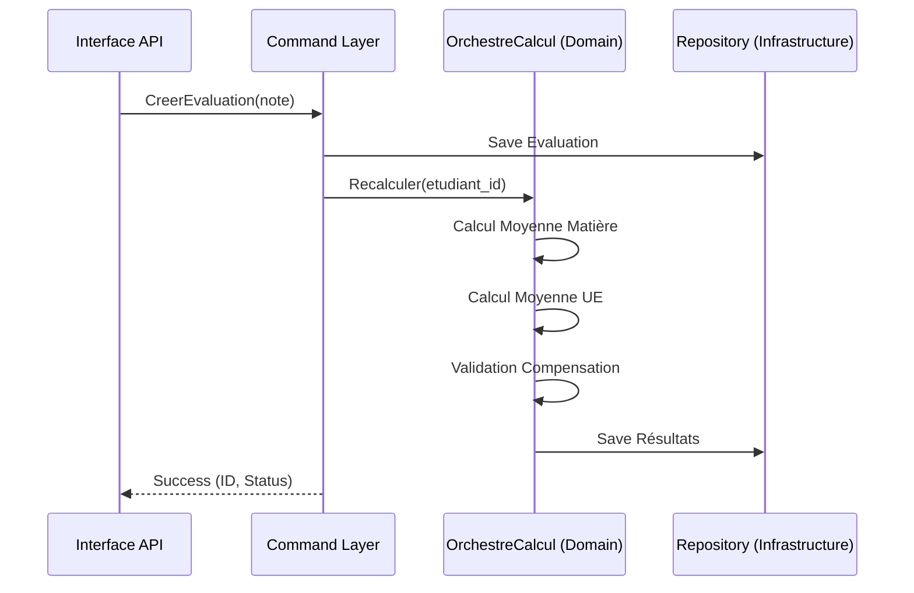

# Bulletin de Notes - Backend DDD (INPTIC)

Ce projet est un système de gestion de bulletins de notes pour l'INPTIC, conçu selon les principes du **Domain-Driven Design (DDD)** et de la **Clean Architecture**.

## 🏗️ Architecture

Le projet est divisé en quatre couches strictes :
1.  **Domain** : Cœur métier (Entités, Value Objects, Calculateurs). Aucune dépendance externe.
2.  **Infrastructure** : Implémentations techniques (Firebase, DI Container).
3.  **Application** : Orchestration via Patterns Command et CQRS (DTO).
4.  **Interfaces** : API REST (Django REST Framework) et CLI.

### Cascade de Calcul (Mermaid)


## 🚀 Installation & Lancement

### Prérequis
- Python 3.11+
- Docker & Docker Compose (Optionnel)
- Un compte Firebase avec Firestore activé

### Installation Locale
1.  **Cloner le dépôt**
2.  **Installer les dépendances** :
    ```bash
    pip install -r requirements.txt
    ```
3.  **Configurer les variables d'environnement** :
    Copier `.env.example` vers `.env` et remplir les clés Firebase.
4.  **Initialiser le Référentiel INPTIC** :
    ```bash
    python manage.py initialiser_referentiel
    ```
5.  **Lancer le serveur** :
    ```bash
    python manage.py runserver
    ```

### Lancement via Docker
```bash
docker-compose up --build
```

## 🧪 Tests & Couverture
Le projet utilise `pytest` pour garantir la fiabilité des calculs métier.
```bash
pytest --cov=domain
```

## 🛡️ Sécurité
- **Authentification** : JWT Firebase obligatoire pour tous les endpoints.
- **RBAC** : Permissions basées sur les Custom Claims (Admin, Enseignant, Étudiant).
- **Validation** : Schémas strictes via Pydantic pour tous les inputs.
- **Rate Limiting** : Limité à 50 requêtes/minute par utilisateur.

---
Déjà déployable sur toute plateforme supportant Docker (Google Cloud Run, AWS App Runner).
