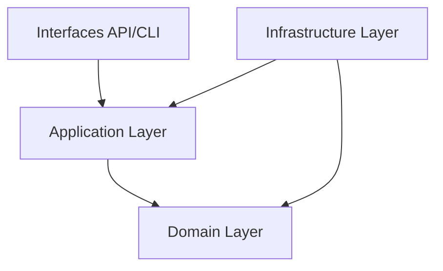

# Architecture du Projet - Clean Architecture et DDD

Le projet est conçu selon les principes de la Clean Architecture et du Domain-Driven Design (DDD) pour assurer une séparation stricte des préoccupations et une extensibilité maximale.

## Structure en Couches

### 1. Domaine (Domain)
Le cœur du système, indépendant de toute technologie externe (Base de données, Web).
- **Entities** : Etudiant, Evaluation, UE, Matiere, Bulletin.
- **Value Objects** : Note, Moyenne, Coefficient.
- **Repository Interfaces** : IEvaluationRepository, IMatiereRepository.
- **Domain Services** : OrchestreCalcul, ValidateurCompensation.

### 2. Application
Coordonne les flux de données et exécute les cas d'utilisation.
- **Commands** : CreerEvaluationCommand, ImporterEvaluationsCommand.
- **Handlers** : EvaluationCommandHandler, ResultatQueryHandler.
- **Application Services** : AuditService, BulletinService.

### 3. Infrastructure
Implémente les détails techniques.
- **Persistence** : FirebaseEvaluationRepository (Firestore).
- **External Tools** : OpenpyxlParser (Excel), ExcelGenerator.
- **Config** : Dependency Injection (Container).

### 4. Interfaces
Points d'entrée du système.
- **REST API** : Django Rest Framework (ViewSets, Serializers).
- **CLI** : Commandes manage.py (Maintenance, Initialisation).

---

## Patterns POO Utilises

### Repository Pattern
Toutes les interactions avec Firestore passent par des interfaces (IEvaluationRepository). Cela permet de changer de base de données sans impacter la logique métier.

### Strategy Pattern
Utilisé dans les calculateurs (CalculateurMatiere, CalculateurUE). L'algorithme de calcul peut varier selon le contexte (rattrapage vs normal) sans modifier l'appelant.

### Observer Pattern (Domain Events)
Implémenté via EventDispatcher. Lorsqu'une note est modifiée, un événement est publié, et le AuditLogHandler réagit pour enregistrer l'action sans coupler les deux services.

---

## Flux de Donnees - Saisie d'une Note

1. **API View** : Reçoit la requête, valide le token Firebase.
2. **Command Handler** : Démarre une transaction Firestore.
3. **Repository** : Enregistre l'entité Evaluation.
4. **Orchestrateur** : Déclenche le recalcul en cascade des moyennes (Matière -> UE -> Semestre).
5. **Event Dispatcher** : Diffuse EvaluationCreee pour la journalisation d'audit.
6. **API Response** : Retourne l'ID de la nouvelle évaluation.
