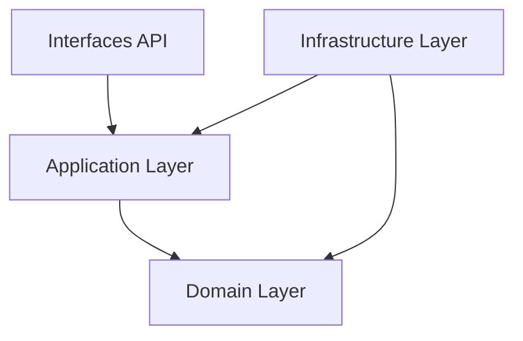

# Architecture du Projet - Clean Architecture et DDD

Le projet est conçu selon les principes de la Clean Architecture et du Domain-Driven Design (DDD) pour assurer une séparation stricte des préoccupations.

## Structure en Couches

### 1. Domaine (Domain)
Le cœur du système, indépendant de toute technologie externe.
- **Entities** : Etudiant, Evaluation, UE, Matière.
- **Value Objects** : Note, Moyenne, Coefficient.
- **Repository Interfaces** : IEvaluationRepository, IMatiereRepository.
- **Domain Services** : OrchestreCalcul, ValidateurCompensation.

### 2. Application
Coordonne les flux de données et exécute les cas d'utilisation business.
- **Commands** : CreerEvaluationCommand, ImporterEvaluationsCommand.
- **Application Services** : AuditService, BulletinService.

### 3. Infrastructure
Implémente les détails techniques et les API tierces.
- **Persistence** : Implémentation PostgreSQL native via Django ORM.
- **Auth** : Supabase Auth Integration.
- **Config** : Dependency Injection (Container python-inject).

### 4. Interfaces
Points d'entrée du système.
- **REST API** : Django Rest Framework (ViewSets, Serializers).

---

## Patterns POO Utilisés

### Repository Pattern
L'accès aux données est abstrait. Nous sommes passés de SQLite/Firebase à **PostgreSQL (Supabase)** sans modifier la logique métier du Domaine.

### Flow de Données - Recalcul Automatique
1. **API** : Valide le JWT Supabase et le rôle.
2. **Command Handler** : Enregistre la Note via le Repository.
3. **Orchestrateur** : Déclenche le recalcul immédiat en cascade (Moyenne Matière -> UE -> Semestre).
4. **Post-Process** : Journalisation d'audit via le service d'audit.
