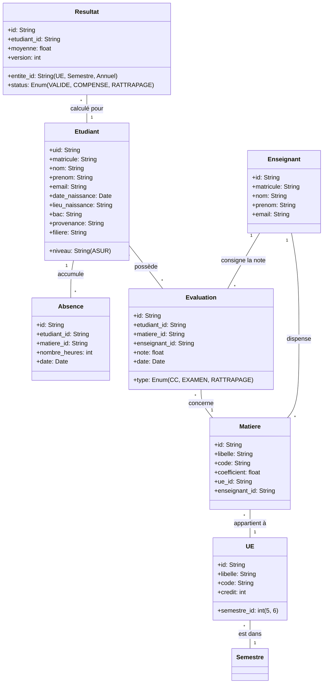

# Modèle de Données Global - Système Bull ASUR

Ce document décrit l'architecture des données du système, incluant les entités du Domaine (DDD) et leur représentation physique dans Firestore.

## 1. Vue d'Ensemble (Diagramme de Classes)

## 2. Schéma Relationnel (Django / PostgreSQL)

### Table `PersonnelModel` (Utilisateurs Staff)
- **Email (PK)** : Identifiant unique Supabase Auth.
- **Champs :**
  - `nom`: string
  - `prenom`: string
  - `role`: "admin" | "secretariat" | "enseignant"
  - `numero_telephone`: string

### Table `EtudiantModel`
- **UID (PK)** : UID Supabase Auth.
- **Champs :**
  - `matricule`: string (Unique)
  - `nom`: string
  - `prenom`: string
  - `date_naissance`: date
  - `filiere`: "ASUR"

### Table `UEModel`
- **Code (PK)** : ex: "UE5-1"
- **Champs :**
  - `libelle`: string
  - `credits`: integer
  - `semestre_id`: integer (ForeignKey vers SemestreModel)

### Table `MatiereModel`
- **ID (PK)** : UUID
- **Champs :**
  - `libelle`: string
  - `coefficient`: float
  - `credits`: integer
  - `ue`: ForeignKey(UEModel)
  - `enseignant_id`: UUID (Référence optionnelle vers PersonnelModel)

### Table `EvaluationModel`
- **ID (PK)** : UUID
- **Champs :**
  - `etudiant`: ForeignKey(EtudiantModel)
  - `matiere`: ForeignKey(MatiereModel)
  - `note`: float (0-20)
  - `type`: "CC" | "EXAMEN" | "RATTRAPAGE"
  - `saisie_par`: string (UID)

### Table `PersonnelAuditModel` (Journal d'Audit)
- **ID (PK)** : UUID
- **Index :** `created_at` (DESC) pour optimisation des performances.
- **Champs :**
  - `action_type`: string (ex: "EVAL_CREATE")
  - `user_id`: string
  - `user_email`: string
  - `ip_address`: string
  - `user_agent`: string
  - `details`: text (JSON stringified)

### Table `ResultatModel`
- **ID (PK)** : UUID
- **Champs :**
  - `etudiant`: ForeignKey(EtudiantModel)
  - `type_calcul`: "UE" | "SEMESTRE" | "ANNUEL"
  - `moyenne`: float
  - `status`: string (VALIDE, COMPENSE, etc.)
  - `updated_at`: timestamp (auto_now)

### 3. Infrastructure
Implémente les détails techniques et les API tierces.
- **Persistence** : Implémentation PostgreSQL (Supabase) via Django ORM. Utilisation de l'indexation temporelle sur les logs d'audit.
- **Auth** : Supabase Auth Integration avec Custom Claims pour les rôles (Admin, Secretariat, Enseignant, Etudiant).
- **Config** : Dependency Injection (Pattern Declarative Container via `dependency-injector`).

### 4. Interfaces
Points d'entrée du système.
- **REST API** : Django Rest Framework (ViewSets, Serializers) avec documentation OpenAPI/Swagger.
- **Security** : Middlewares de protection par rôle (Admin-Only, Secretariat-Only).

---

## Patterns POO Utilisés

### Repository Pattern
L'accès aux données est abstrait. La migration vers **PostgreSQL (Supabase)** a été réalisée en isolant les implémentations Django sans modifier la logique métier du Domaine.

### Observer & Events
Le système utilise un Dispatcher d'événements interne :
1. Une note est créée (`EvaluationCreee`).
2. L'`AuditLogHandler` (abonné) capture l'événement.
3. L'action est persistée dans `PersonnelAuditModel` avec les métadonnées (IP, User-Agent).

### Flow de Données - Recalcul Automatique
1. **API** : Valide le JWT Supabase et le rôle.
2. **Command Handler** : Enregistre la Note via le Repository.
3. **Orchestrateur** : Déclenche le recalcul immédiat en cascade (Moyenne Matière -> UE -> Semestre).
4. **Post-Process** : Journalisation d'audit via le service d'audit.
