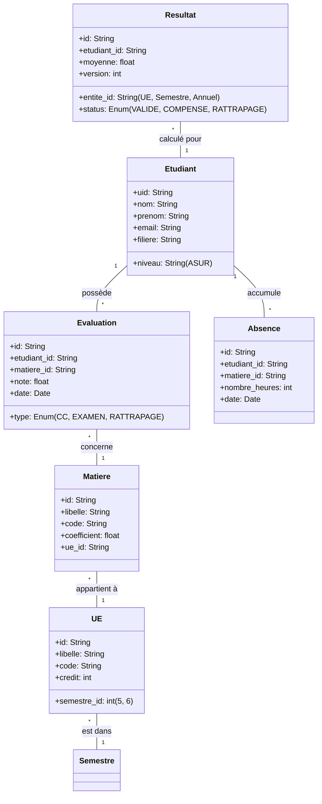

# Modèle de Données Global - Système Bull ASUR

Ce document décrit l'architecture des données du système, incluant les entités du Domaine (DDD) et leur représentation physique dans Firestore.

## 1. Vue d'Ensemble (Diagramme de Classes)

## 2. Schéma Firestore (Collections)

### Collection `etudiants`
- **ID Document :** UID Firebase
- **Champs :**
  - `nom`: string
  - `prenom`: string
  - `email`: string
  - `filiere`: string
  - `niveau`: string
  - `role`: "etudiant" (Custom Claim)

### Collection `ues`
- **ID Document :** ID UE (ex: "ASUR-UE1")
- **Champs :**
  - `libelle`: string
  - `code`: string
  - `semestre_id`: integer (5 ou 6)
  - `credits`: integer

### Collection `matieres`
- **ID Document :** ID Matiere
- **Champs :**
  - `libelle`: string
  - `code`: string
  - `coefficient`: float
  - `ue_id`: string (Référence à `ues`)

### Collection `evaluations`
- **ID Document :** Auto-généré
- **Champs :**
  - `etudiant_id`: string
  - `matiere_id`: string
  - `type`: "CC" | "EXAMEN" | "RATTRAPAGE"
  - `note`: float [0-20]
  - `date_evaluation`: timestamp

### Collection `absences`
- **ID Document :** Auto-généré
- **Champs :**
  - `etudiant_id`: string
  - `matiere_id`: string
  - `nombre_heures`: integer
  - `date_absence`: timestamp

### Collection `resultats_acad`
- **ID Document :** `{etudiant_id}_{type}_{ref_id}`
- **Champs :**
  - `etudiant_id`: string
  - `type_calcul`: "UE" | "SEMESTRE" | "ANNUEL"
  - `reference_id`: string (ID UE, ID Semestre ou "ANNUEL")
  - `moyenne`: float
  - `credits_obtenus`: float
  - `status`: string
  - `updated_at`: timestamp

## 3. Logique de Calcul (Règles Académiques)

1. **Moyenne UE :** Moyenne des matières pondérée par leurs coefficients respectifs.
2. **Moyenne Semestre :** Moyenne des UEs pondérée par leurs crédits.
3. **Moyenne Annuelle :** Moyenne arithmétique de S5 et S6.
4. **Compensation :**
   - Une UE est compensée si la moyenne du semestre est >= 10/20.
   - Les notes < 10 ne bloquent pas le passage si la moyenne générale compense.
   - Exception : Absence injustifiée (0.0) peut être non compensable selon règles spécifiques.

## 4. Sécurité des Données

- **Propriétaire :** Un étudiant ne peut lire que ses propres données (règles de sécurité Firestore).
- **Saisie :** Seuls les comptes ayant le rôle `admin` ou `secretariat` peuvent modifier les notes et absences.
- **Audit :** Toutes les modifications sensibles sont enregistrées dans la collection `audits` (logs).
