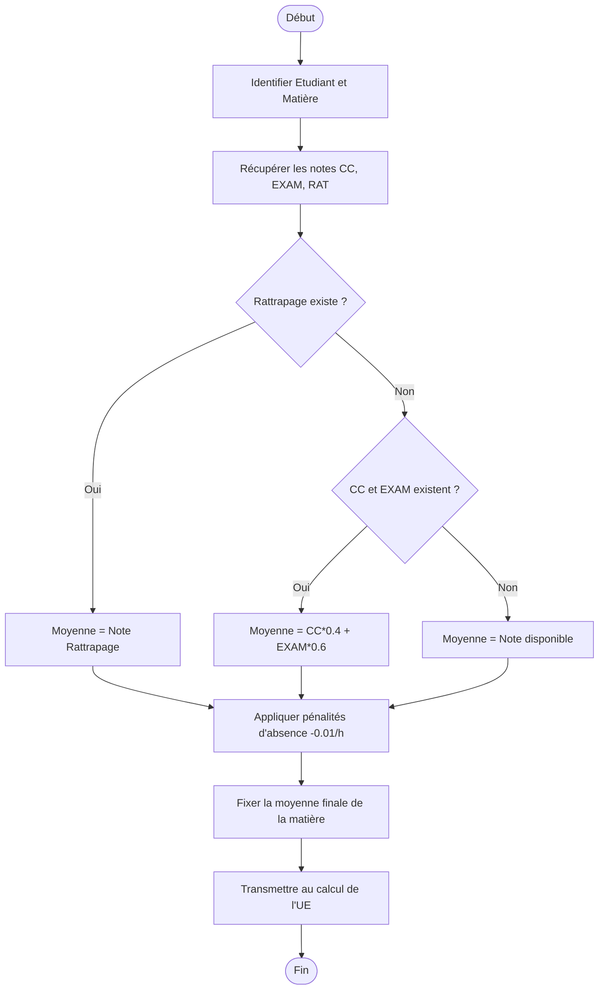

# Diagramme d'Activité - Calcul des Moyennes

Ce diagramme détaille l'algorithme de calcul des moyennes selon les règles du cahier des charges.

```mermaid
graph TD
    Start([Début]) --> ID[Identifier Etudiant et Matière]
    ID --> GetData[Récupérer les notes CC, EXAM, RAT]
    
    GetData --> CheckRAT{Rattrapage existe ?}
    CheckRAT -- Oui --> RAT_Rule[Moyenne = Note Rattrapage]
    CheckRAT -- Non --> CheckCCEX{CC et EXAM existent ?}
    
    CheckCCEX -- Oui --> CCEX_Rule[Moyenne = CC*0.4 + EXAM*0.6]
    CheckCCEX -- Non --> Single_Rule[Moyenne = Note disponible]
    
    RAT_Rule --> Penalty[Appliquer pénalités d'absence -0.01/h]
    CCEX_Rule --> Penalty
    Single_Rule --> Penalty
    
    Penalty --> Final[Fixer la moyenne finale de la matière]
    Final --> UE[Transmettre au calcul de l'UE]
    UE --> End([Fin])
```
