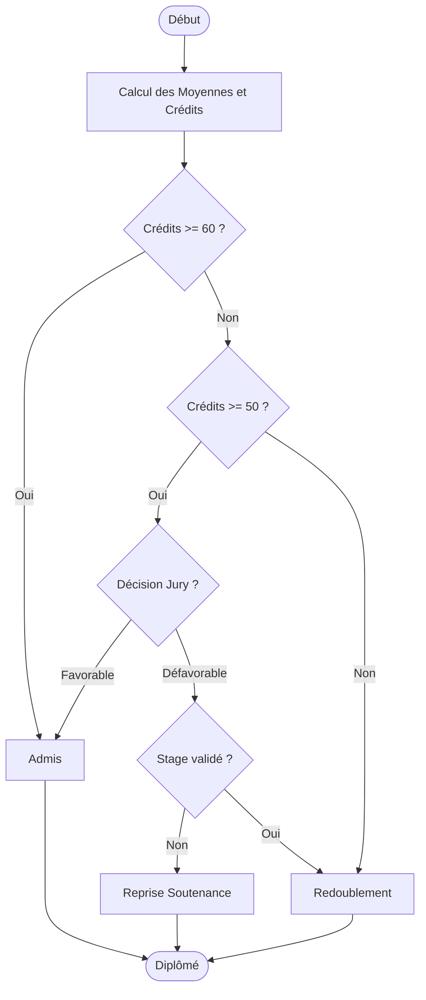

# Diagramme d'Activité - Délibération du Jury

Ce diagramme illustre le processus de décision lors des délibérations.

```mermaid
graph TD
    Start([Début]) --> Calc[Calcul des Moyennes et Crédits]
    Calc --> Check60{Crédits >= 60 ?}
    
    Check60 -- Oui --> Admis[Admis]
    Check60 -- Non --> Check50{Crédits >= 50 ?}
    
    Check50 -- Oui --> Jury{Décision Jury ?}
    Check50 -- Non --> Redouble[Redoublement]
    
    Jury -- Favorable --> Admis
    Jury -- Défavorable --> Stage{Stage validé ?}
    
    Stage -- Non --> Soutenance[Reprise Soutenance]
    Stage -- Oui --> Redouble
    
    Admis --> End([Diplômé])
    Redouble --> End
    Soutenance --> End
```
