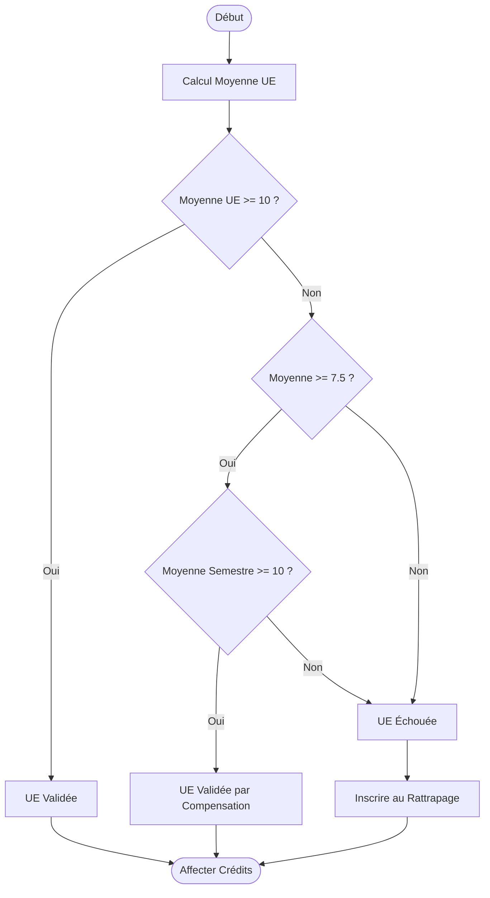

# Diagramme d'Activité - Validation d'UE et Compensation

Logique de validation des Unités d'Enseignement.

```mermaid
graph TD
    Start([Début]) --> CalcUE[Calcul Moyenne UE]
    CalcUE --> Check10{Moyenne UE >= 10 ?}
    
    Check10 -- Oui --> Valid[UE Validée]
    Check10 -- Non --> Comp{Moyenne >= 7.5 ?}
    
    Comp -- Oui --> SemCheck{Moyenne Semestre >= 10 ?}
    Comp -- Non --> Failing[UE Échouée]
    
    SemCheck -- Oui --> Compensated[UE Validée par Compensation]
    SemCheck -- Non --> Failing
    
    Valid --> End([Affecter Crédits])
    Compensated --> End
    Failing --> Reprise[Inscrire au Rattrapage]
    Reprise --> End
```
