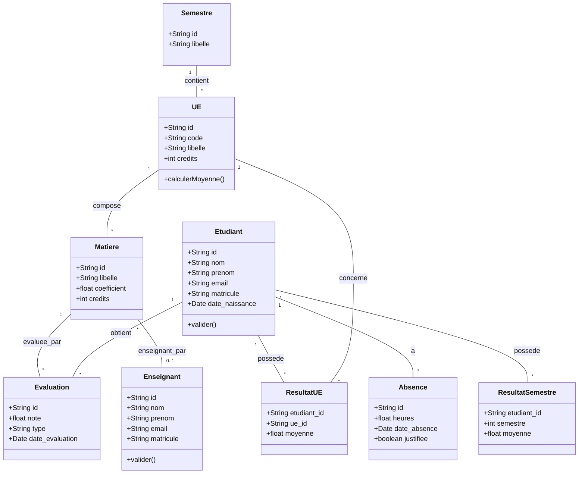

# Diagramme de Classes (Class Diagram)

Ce diagramme représente la structure statique du domaine métier et les relations entre les entités.

```mermaid
classDiagram
    class Etudiant {
        +String id
        +String nom
        +String prenom
        +String email
        +String matricule
        +Date date_naissance
        +valider()
    }

    class Enseignant {
        +String id
        +String nom
        +String prenom
        +String email
        +String matricule
        +valider()
    }

    class Semestre {
        +String id
        +String libelle
    }

    class UE {
        +String id
        +String code
        +String libelle
        +int credits
        +calculerMoyenne()
    }

    class Matiere {
        +String id
        +String libelle
        +float coefficient
        +int credits
    }

    class Evaluation {
        +String id
        +float note
        +String type
        +Date date_evaluation
    }

    class Absence {
        +String id
        +float heures
        +Date date_absence
        +boolean justifiee
    }

    class ResultatUE {
        +String etudiant_id
        +String ue_id
        +float moyenne
    }

    class ResultatSemestre {
        +String etudiant_id
        +int semestre
        +float moyenne
    }

    Semestre "1" -- "*" UE : contient
    UE "1" -- "*" Matiere : compose
    Matiere "1" -- "*" Evaluation : evaluee_par
    Etudiant "1" -- "*" Evaluation : obtient
    Etudiant "1" -- "*" Absence : a
    Matiere "*" -- "0..1" Enseignant : enseignant_par
    
    Etudiant "1" -- "*" ResultatUE : possede
    UE "1" -- "*" ResultatUE : concerne
    Etudiant "1" -- "*" ResultatSemestre : possede
```
