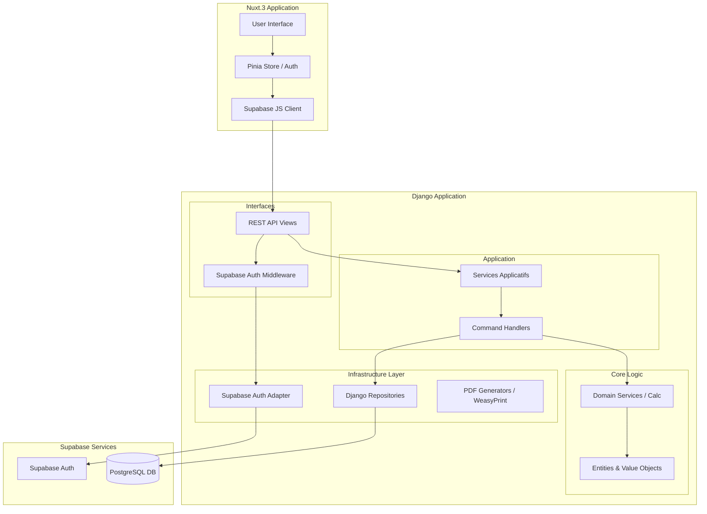

# Diagramme de Composants (Component Diagram)

Architecture modulaire du système Bulletin Notes.

```mermaid
graph TD
    subgraph Frontend [Nuxt.3 Application]
        UI[User Interface]
        Store[Pinia Store / Auth]
        API_Client[Supabase JS Client]
    end

    subgraph Backend [Django Application]
        subgraph Interfaces
            REST[REST API Views]
            Middle[Supabase Auth Middleware]
        end
        
        subgraph Application
            AppSvc[Services Applicatifs]
            Cmd[Command Handlers]
        end
        
        subgraph Domain [Core Logic]
            Entities[Entities & Value Objects]
            Rules[Domain Services / Calc]
        end
        
        subgraph "Infrastructure Layer"
            Repo[Django Repositories]
            Auth[Supabase Auth Adapter]
            PDF[PDF Generators / WeasyPrint]
        end
    end

    subgraph External [Supabase Services]
        SupaAuth[Supabase Auth]
        Postgres[(PostgreSQL DB)]
    end

    UI --> Store
    Store --> API_Client
    API_Client ----> REST
    
    REST --> Middle
    Middle --> Auth
    REST --> AppSvc
    AppSvc --> Cmd
    Cmd --> Rules
    Rules --> Entities
    Cmd --> Repo
    Repo --> Postgres
    Auth --> SupaAuth
```
