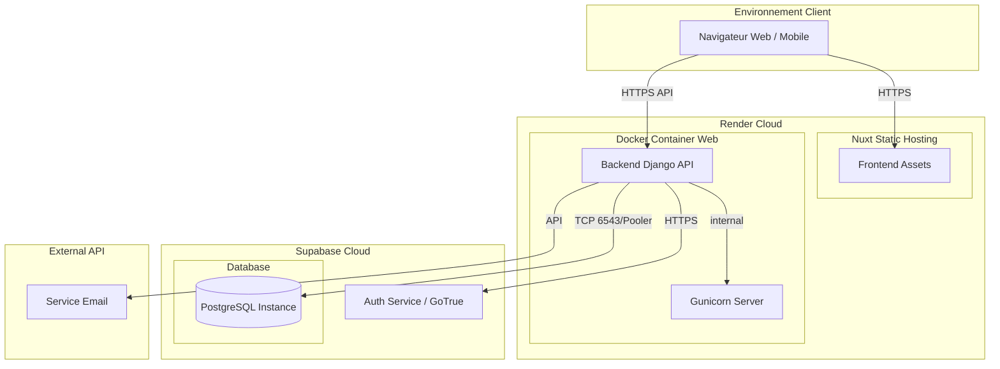

# Diagramme de Déploiement (Deployment Diagram)

Topologie de l'infrastructure de production sur Cloud PaaS.

```mermaid
graph TD
    subgraph Client [Environnement Client]
        Browser[Navigateur Web / Mobile]
    end

    subgraph "Render Cloud"
        subgraph Static_Host [Nuxt Static Hosting]
            Front[Frontend Assets]
        end
        
        subgraph Compute [Docker Container Web]
            Django[Backend Django API]
            Gunicorn[Gunicorn Server]
        end
    end

    subgraph "Supabase Cloud"
        Auth[Auth Service / GoTrue]
        subgraph Storage [Database]
            Postgres[(PostgreSQL Instance)]
        end
    end

    subgraph "External API"
        SMTP[Service Email]
    end

    Browser -- HTTPS --> Front
    Browser -- HTTPS API --> Django
    Django -- internal --> Gunicorn
    Django -- TCP 6543/Pooler --> Postgres
    Django -- HTTPS --> Auth
    Django -- API --> SMTP
```
