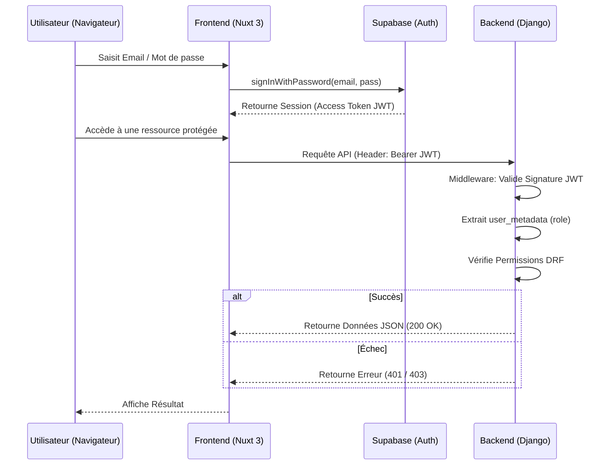

# Diagramme de Séquence - Authentification (JWT Supabase)

Ce diagramme illustre le flux d'authentification entre le Frontend, Supabase et le Backend Django.

```mermaid
sequenceDiagram
    participant U as Utilisateur (Navigateur)
    participant F as Frontend (Nuxt 3)
    participant S as Supabase (Auth)
    participant B as Backend (Django)

    U->>F: Saisit Email / Mot de passe
    F->>S: signInWithPassword(email, pass)
    S-->>F: Retourne Session (Access Token JWT)
    
    U->>F: Accède à une ressource protégée
    F->>B: Requête API (Header: Bearer JWT)
    
    B->>B: Middleware: Valide Signature JWT
    B->>B: Extrait user_metadata (role)
    B->>B: Vérifie Permissions DRF
    
    alt Succès
        B-->>F: Retourne Données JSON (200 OK)
    else Échec
        B-->>F: Retourne Erreur (401 / 403)
    end
    
    F-->>U: Affiche Résultat
```
