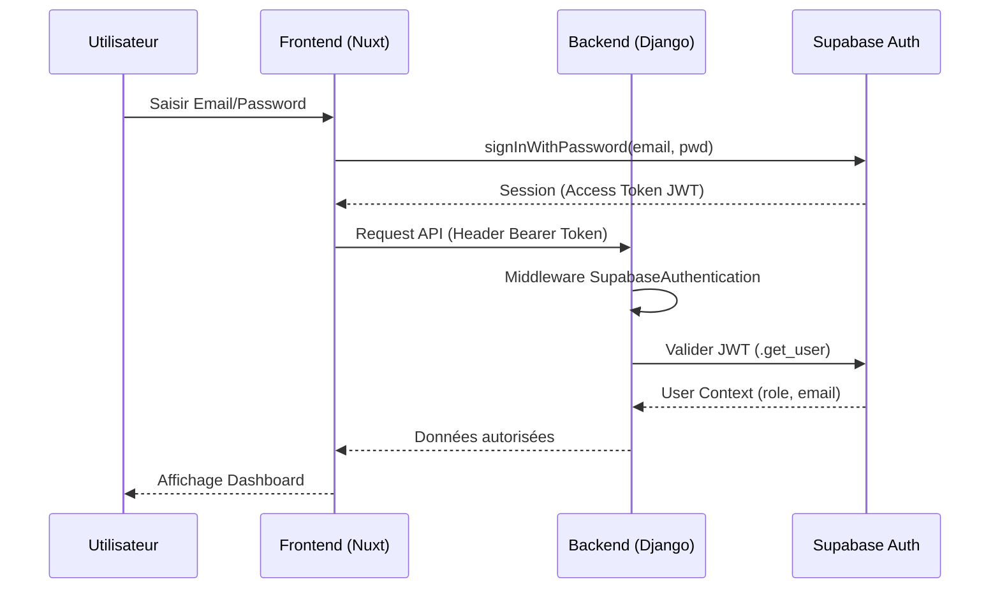

# Diagramme de Séquence - Authentification

Ce diagramme illustre le flux d'authentification entre le Frontend, le Backend et Supabase.

```mermaid
sequenceDiagram
    participant U as Utilisateur
    participant F as Frontend (Nuxt)
    participant B as Backend (Django)
    participant S as Supabase Auth

    U->>F: Saisir Email/Password
    F->>S: signInWithPassword(email, pwd)
    S-->>F: Session (Access Token JWT)
    
    F->>B: Request API (Header Bearer Token)
    B->>B: Middleware SupabaseAuthentication
    B->>S: Valider JWT (.get_user)
    S-->>B: User Context (role, email)
    
    B-->>F: Données autorisées
    F-->>U: Affichage Dashboard
```
