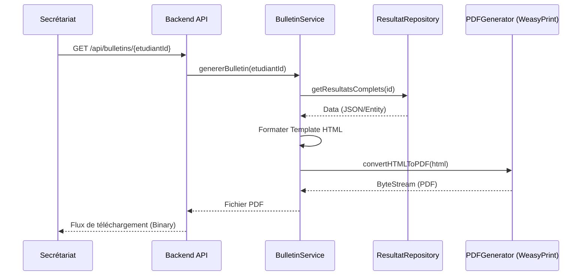

# Diagramme de Séquence - Génération de Bulletin

Ce diagramme illustre la production d'un bulletin PDF pour un étudiant.

```mermaid
sequenceDiagram
    participant S as Secrétariat
    participant B as Backend API
    participant SVC as BulletinService
    participant REP as ResultatRepository
    participant GEN as PDFGenerator (WeasyPrint)

    S->>B: GET /api/bulletins/{etudiantId}
    B->>SVC: genererBulletin(etudiantId)
    SVC->>REP: getResultatsComplets(id)
    REP-->>SVC: Data (JSON/Entity)
    
    SVC->>SVC: Formater Template HTML
    SVC->>GEN: convertHTMLToPDF(html)
    GEN-->>SVC: ByteStream (PDF)
    
    SVC-->>B: Fichier PDF
    B-->>S: Flux de téléchargement (Binary)
```
