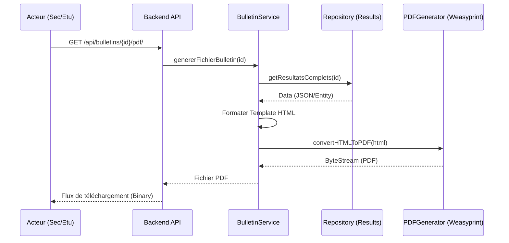

# Diagramme de Séquence - Génération Bulletin

Ce diagramme illustre le flux de génération d'un bulletin de notes individuel.

```mermaid
sequenceDiagram
    participant S as Acteur (Sec/Etu)
    participant B as Backend API
    participant SVC as BulletinService
    participant REP as Repository (Results)
    participant GEN as PDFGenerator (Weasyprint)

    S->>B: GET /api/bulletins/{id}/pdf/
    B->>SVC: genererFichierBulletin(id)
    SVC->>REP: getResultatsComplets(id)
    REP-->>SVC: Data (JSON/Entity)
    
    SVC->>SVC: Formater Template HTML
    SVC->>GEN: convertHTMLToPDF(html)
    GEN-->>SVC: ByteStream (PDF)
    
    SVC-->>B: Fichier PDF
    B-->>S: Flux de téléchargement (Binary)
```
