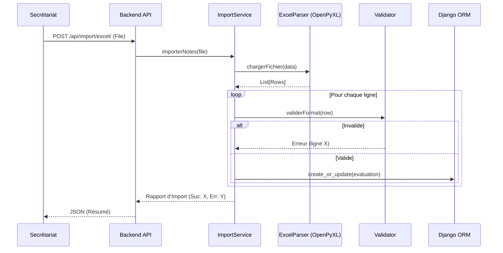

# Diagramme de Séquence - Import Excel

Ce diagramme illustre le processus d'importation de masse des notes depuis un fichier Excel.

```mermaid
sequenceDiagram
    participant S as Secrétariat
    participant B as Backend API
    participant SVC as ImportService
    participant XLS as ExcelParser (OpenPyXL)
    participant VAL as Validator
    participant ORM as Django ORM

    S->>B: POST /api/import/excel/ (File)
    B->>SVC: importerNotes(file)
    SVC->>XLS: chargerFichier(data)
    XLS-->>SVC: List[Rows]
    
    loop Pour chaque ligne
        SVC->>VAL: validerFormat(row)
        alt Invalide
            VAL-->>SVC: Erreur (ligne X)
        else Valide
            SVC->>ORM: create_or_update(evaluation)
        end
    end
    
    SVC-->>B: Rapport d'Import (Suc: X, Err: Y)
    B-->>S: JSON (Résumé)
```
