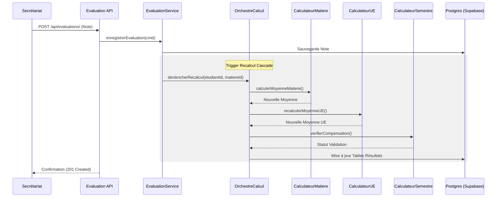

# Diagramme de Séquence - Saisie Note + Recalcul

Ce diagramme illustre la cascade de calculs déclenchée par la saisie d'une note.

```mermaid
sequenceDiagram
    participant S as Secrétariat
    participant API as Evaluation API
    participant SVC as EvaluationService
    participant ORC as OrchestreCalcul
    participant MAT as CalculateurMatiere
    participant UE as CalculateurUE
    participant SEM as CalculateurSemestre
    participant DB as Postgres (Supabase)

    S->>API: POST /api/evaluations/ (Note)
    API->>SVC: enregistrerEvaluation(cmd)
    SVC->>DB: Sauvegarde Note
    
    rect rgb(240, 240, 240)
    Note over ORC: Trigger Recalcul Cascade
    SVC->>ORC: declencherRecalcul(etudiantId, matiereId)
    ORC->>MAT: calculerMoyenneMatiere()
    MAT-->>ORC: Nouvelle Moyenne
    ORC->>UE: recalculerMoyenneUE()
    UE-->>ORC: Nouvelle Moyenne UE
    ORC->>SEM: verifierCompensation()
    SEM-->>ORC: Statut Validation
    ORC->>DB: Mise à jour Tables Résultats
    end
    
    API-->>S: Confirmation (201 Created)
```
