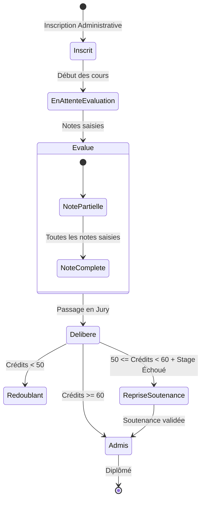

# Diagramme d'États-Transitions - Étudiant

Ce diagramme modélise le cycle de vie d'un étudiant au sein du système.

```mermaid
stateDiagram-v2
    [*] --> Inscrit: Inscription Administrative
    Inscrit --> EnAttenteEvaluation: Début des cours
    EnAttenteEvaluation --> Evalue: Notes saisies
    
    state Evalue {
        [*] --> NotePartielle
        NotePartielle --> NoteComplete: Toutes les notes saisies
    }
    
    Evalue --> Delibere: Passage en Jury
    
    Delibere --> Admis: Crédits >= 60
    Delibere --> Redoublant: Crédits < 50
    Delibere --> RepriseSoutenance: 50 <= Crédits < 60 + Stage Échoué
    
    Admis --> [*]: Diplômé
    RepriseSoutenance --> Admis: Soutenance validée
```
