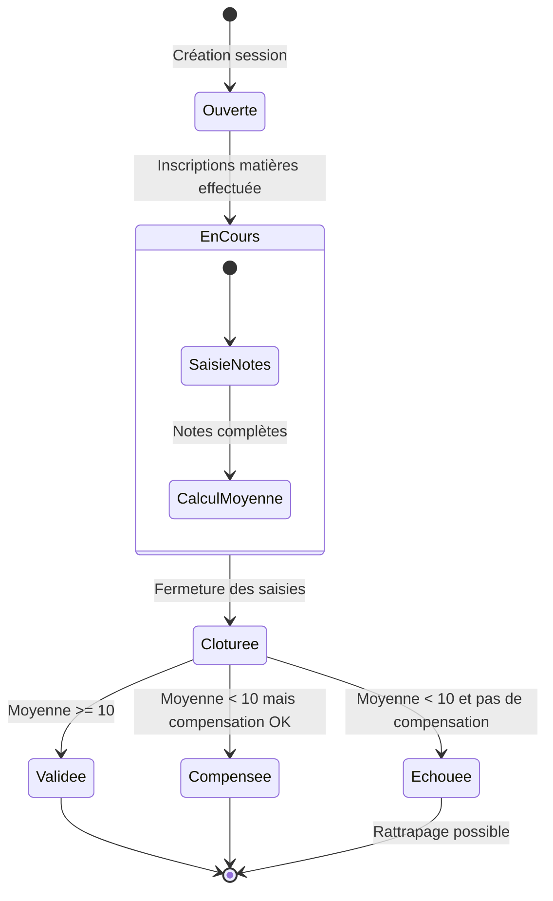

# Diagramme d'États-Transitions - Unité d'Enseignement (UE)

Ce diagramme illustre les différents états d'une UE au cours d'un semestre.

```mermaid
stateDiagram-v2
    [*] --> Ouverte: Création session
    Ouverte --> EnCours: Inscriptions matières effectuée
    
    state EnCours {
        [*] --> SaisieNotes
        SaisieNotes --> CalculMoyenne: Notes complètes
    }
    
    EnCours --> Cloturee: Fermeture des saisies
    
    Cloturee --> Validee: Moyenne >= 10
    Cloturee --> Compensee: Moyenne < 10 mais compensation OK
    Cloturee --> Echouee: Moyenne < 10 et pas de compensation
    
    Validee --> [*]
    Compensee --> [*]
    Echouee --> [*]: Rattrapage possible
```
