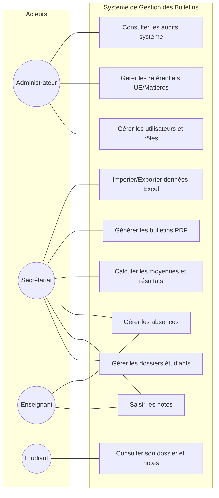

# Diagramme de Cas d'Utilisation Global

Ce diagramme présente une vue d'ensemble des interactions entre les différents acteurs et le système de gestion des bulletins.

```mermaid
graph LR
    subgraph Acteurs
        Admin((Administrateur))
        Sec((Secrétariat))
        Ens((Enseignant))
        Etu((Étudiant))
    end

    subgraph "Système de Gestion des Bulletins"
        UC1[Gérer les utilisateurs et rôles]
        UC2[Gérer les référentiels UE/Matières]
        UC3[Gérer les dossiers étudiants]
        UC4[Saisir les notes]
        UC5[Gérer les absences]
        UC6[Calculer les moyennes et résultats]
        UC7[Générer les bulletins PDF]
        UC8[Consulter son dossier et notes]
        UC9[Importer/Exporter données Excel]
        UC10[Consulter les audits système]
    end

    Admin --- UC1
    Admin --- UC2
    Admin --- UC10

    Sec --- UC3
    Sec --- UC4
    Sec --- UC5
    Sec --- UC6
    Sec --- UC7
    Sec --- UC9

    Ens --- UC4
    Ens --- UC5

    Etu --- UC8
```
